# Tema 4 Redes Locales

---

## Índice
1. [Cables UTP](#cables-utp)
2. [Métodos de transmisión](#métodos-de-transmisión)
3. [Fibra óptica](#fibra-óptica)
4. [Estándares Ethernet]()
5. [Cableado estructurado]()
6. [Ejercicios prácticos]()

---

## Cables UTP
### ¿Qué es un tester o probador?

Es un dispositivo de prueba de **cables de par trenzado de cobre**. 

Emite una señal eléctrica por **cada uno** de los pines o hilos del conector RJ45 y **comprueba** su llegada en la otra parte del probador. 

Es de gran utilidad para saber si los hilos de nuestro cable hacen un **correcto contacto** con el conector RJ45. 

### Latiguillos y crimpado
Existen dos estándares principales para la disposición de los hilos de cobre en el conector RJ45, estos son:

Estos latiguillos pueden ser **directos** o **cruzados**. 

En el caso de una conexión entre un equipo y un switch/router/hub no es necesario un cable cruzado, usaremos un cable **directo**, porque este es capaz de organizar internamente el orden de los pines. 

En el caso de una conexión entre dos equipos deberemos usar un cable de par trenzado de cobre **cruzado**. 

Si decidieramos usar en cable **directo** para interconectar dos equipos nos encontraríamos con que el hilo usado para transferencia coincidirá con el hilo de transferencia de el otro extremo, lo cual causará una colisión: 
Se debe alterar el orden para que un extremo de transferencia coincida con el de recepción del otro extremo. 

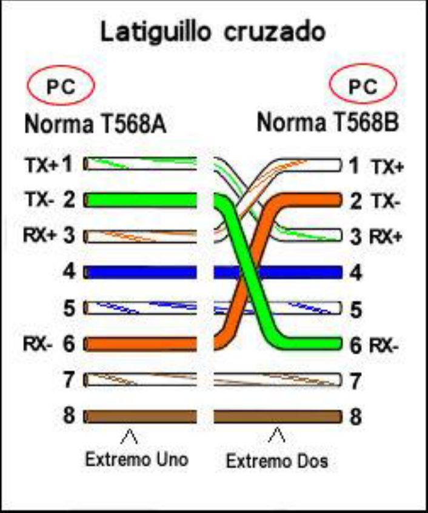

### Recursos
- [Crimpar RJ45](https://www.youtube.com/watch?v=YCEGfxOX5Ws)
- [Montaje de una LAN](https://www.youtube.com/watch?v=Wa2GF5DIv9I)

---

## Métodos de transmisión
### Bandas de transmisión

- **Banda base** -> Solo se transmite una única comunicación, la señal es enviada tal cual por el medio de transmisión.
- **Banda ancha** -> Se transmiten varias comunicaciones simultáneas, la señal se modula para poder transportar varias por el mismo medio de transmisión.

### Parámetros de transmisión

- **Velocidad de transmisión** -> Cantidad de información transmitida por unidad de tiempo, medida en bits por segundo.
- **Ancho de banda** -> Máxima velocidad de transmisión que ofrece un medio de transmisión en condiciones ideales.
- **Latencia** -> Tiempo que tarda un primer bit transmitido desde que se emite hasta que llega a destino.
- **Atenuación** -> Pérdida de potencia de una señal producida al transitar por el medio. Aumenta conforme a la distancia recorrida. Se mide en **decibelios (dB)** o en porcentajes.
- **Ruido (interferencia electromagnética)** -> Perturbación de la señal original causada por la inducción electromagnética.
- **Dispersión** -> Se produce en medios de transmisión ópticos (luz) debido a la variación del ángulo de incidencia del haz de luz.
- **Diafonía o *crosstalk*** -> Interferencia producida entre señales cuando los cables están muy juntos.

### Transmisiones: Analógicas vs Digitales

- **Señal analógica** -> Valores continuos, por ejemplo: 1V, 1.5V, 2V, 3V, 3.2V, 5V...
- **Señal digital** -> Valores discretos, por ejemplo: 0V o 5V (0 o 1), no hay un punto medio.

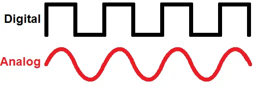

### Medios: guiados vs no guiados

- **Guiados** -> El medio de transmisión físico es un cable, tipos:
	- **Par paralelo**
		- Dos hilos de cobre
		- Comunicación semiduplex (comunicación bidireccional, no simultánea)
		- Poca protección frente a interferencias
		- Conector RJ11
	- **Par trenzado**
		- Un par trenzado son dos hilos de cobre trenzados, el trenzado sirve para reducir las interferencias entre los hilos
		- Cable más resistente
		- Cables con cuatro pares (ocho hilos)
		- Usado en redes de área local
		- Conector RJ45
		- Distintas categorías (CAT-(5,6,7...))
		- Más simple y económico de todos los medios de transmisión
		- Se necesitan repetidores de señal al sobrepasar ciertas longitues de cable
		- Máximo 100 metros **sin** repetidores
		- **UTP (Unshielded Twisted Pair)(Par trenzado sin apantallar)**
		- **FTP (Foiled-Screen TP)(Par trenzado apantallado)**
		- **STP (Shielded TP)(Par trenzado blindado)**
	- **Cable coaxial**
		- Más inmunes al ruido que el par trenzado
		- Mayores distancias entre equipos que el par trenzado (atenuación menor por distancia recorrida)
		- Cable usado para conectar antenas
		- Dos tipos:
			- Fino
				- RG58 uso 10BASE2
				- Se usaba para montar redes locales en bus principalmente
				- Conector BNC
			- Grueso
				- RG11 uso 10BASE5
				- Se emplea para cableados verticales de edificios (backbone)
				- Presenta gran inmunidad al ruido
				- Difícil instalación
				- Distancia mayor que el par trenzado (500 metros)
	- **Fibra óptica**
		- Hilo muy fino de material transparente
		- Vidrio o materiales plásticos
		- Se envían pulsos de luz
		- Compuesto por:
			- Núcleo
			- Revestimiento

		

		- Haz de luz confinado, rebota a lo largo de las paredes del núcleo
		- Cara
		- Difícil de instalar
		- Peligros (pinchazos, vista...)
		- Prácticamente inmune a las interferencias electromagnéticas
		- Velocidades de hasta 20Gb/s en uso real
		- Atenuación pequeña, distancias de hasta 60 km
		- Varios tipos de conectores

		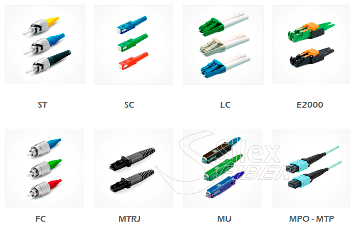

		- **Multimodo**
			- Distancias sobre 2000 metros
			- Uso relativamente poco costoso
			- Transmisores LED

		- **Monomodo**
			- Núcleo 8 - 10 micras
			- La fibra se comporta como una guía de ondas con una sola forma de propragación
			- Ancho de banda muy elevado
			- Distancia de más de 100km
			- Transmisores láser
			- Más cara que la fibra multimodo

		- **Ventajas de la fibra óptica**
			- Velocidades de transmisión elevadas
			- Baja atenuación, permite grandes distancias sin repetidores
			- Prácticamente no sufre interferencias electromagnéticas

		- **Desventajas de la fibra óptica**
			- Difícil de instalar, los cables se pueden doblar muy poco
			- Los empalmes de fibra son caros y de una considerable complejidad
			- Más cara que otros medios de transmisión

		- **Comercialización**
			- Tubo ajustado
				- No puede usarse en exteriores
				- Uno o dos hilos por cable
				- Es la presentación típica en latiguillos
				- Muy flexible
				- No requiere *fan-out* o distribuidor
			- Tubo holgado
				- Contiene un gel que no permite la aparición de humedad
				- Buena protección de la fibra
				- Adaptado para uso externo
				- Un gran número de fibras puede formar un cable no tan grueso
				- Requiere *fan-out* o distribuidor

		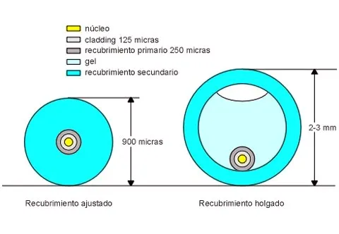

		- **Conectorización**
			- Empalmes mecánicos -> Corte cuidadoso en cada una de las fibras y se unen sus núcleos mediante una manga especial. 
			Habrá que ajustar el alineamiento. Pérdidas en torno a el 10% (altas) 
			- Empalme por fusión -> Se funden ambos núcleos de las fibras mediante un arco eléctrico para hacer una conexión sólida. 
			Se producirá algo de atenuación, empalme ideal.

- **No guiados**
	- Transmiten datos por ondas electromagnéticas
	- Requiere antenas tanto para lr recepción como para la transmisión
	- La frecuencia de la onda determinará en gran medida su comportamiento al atravesar un obstáculo y su intensidad determinará el alcance máximo
	- **Tipos**
		- Infrarrojos
		- Luz visible
		- Microondas
		- Redes wifi
		- Bluetooth
		- Por satélite

### Tipos de transmisión
- **Transmisión en serie** -> Los bits se envían uno detras de otro
- **Transmisión en paralelo** -> Se envían los bits agrupados, un grupo detrás de otro

### Modo de comunicación

- **Simplex** -> Un dispositivo actúa siempre como emisor y el otro como receptor. La información sólo se puede enviar en un único sentido.
- **Half-Duplex (SemiDuplex)** -> Permite el uso del canal para enviar datos en ambas direcciones, pero no de forma simultánea
- **Full-Duplex** -> Permite enviar y recibir datos por el mismo canal de forma simultánea entre dos dispositivos 

### Recursos
- [Presentacion](./medios-de-transmision.odp)
- [PDF](./medios-de-transmision.pdf)
- [Diferencias-CAT5-CAT6](https://www.youtube.com/watch?v=xrUvHGealZg)

---

## Fibra óptica

- **Composición de la fibra**

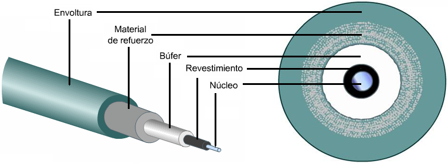

- **Fibra multimodo** -> Varios haces de luz, la luz rebota en las paredes del núcleo y se confina gracias al revestimiento o *cladding*, 2km max.

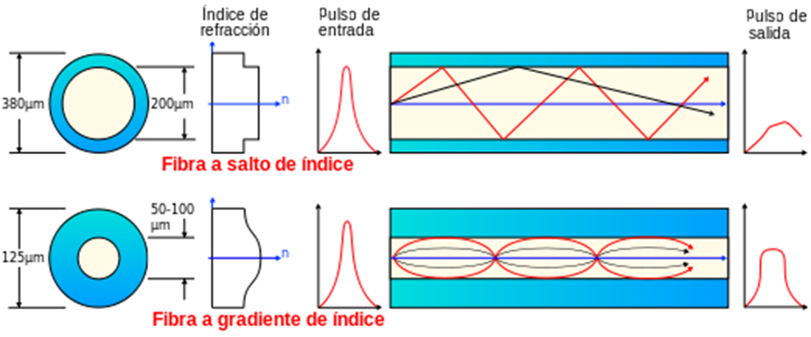

- **Fibra monomodo** -> Un solo haz de luz, que está muy bien confinado en el núcleo, 400km max.

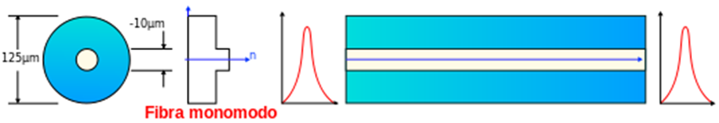

- **Fibra holgada vs ajustada**

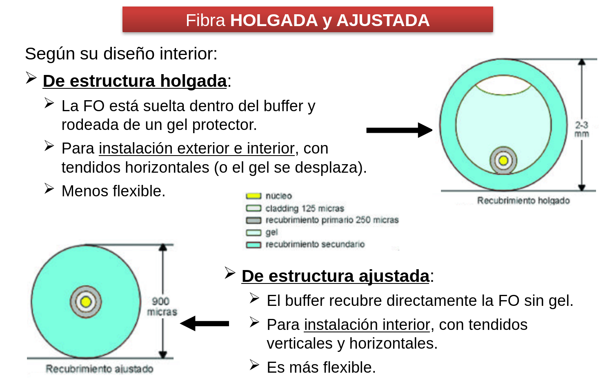

- **Fibra óptica plástica (*POF*)**
	- Núcleo mayor (20-100 veces mayor)
	- Más económica
	- Mayor flexibilidad
	- No tan rápida como la fibra tradicional, pero superior al cobre
	- < 100 metros

- **Atenuación** -> Pérdida de energía que sufre la señal al ser transmitida por el medio de transmisión

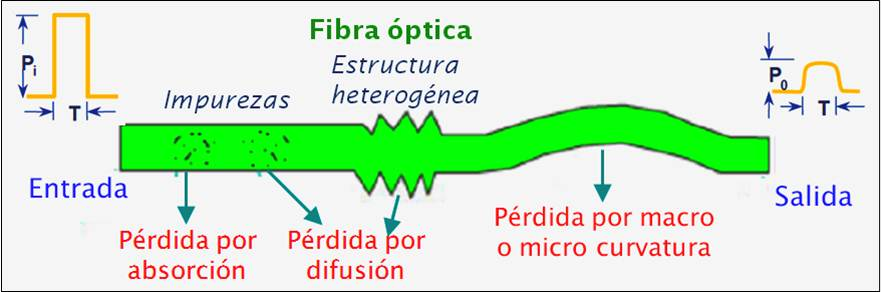

- **Dispersión** -> Ocurre porque el pulso de luz viaja a diferentes velocidades (modos) por la fibra óptica.

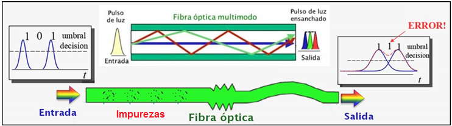

- **Amplificador de fibra**
	- **Restore:** Restaura la intensidad pero no suprime los defectos

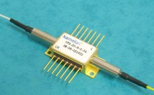

- **Repetidor de fibra**
	- **Restore:** Restaura la intensidad inicial
	- **Reshape:** Corrige las distorsiones en la forma
	- **Resynchronize:** Corrige las desincronizaciones de reloj

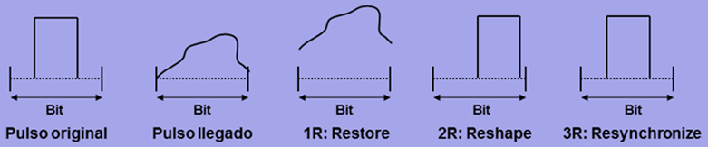

- **Caja de empalme**

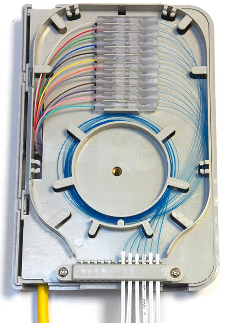

- **Torpedo estanco**

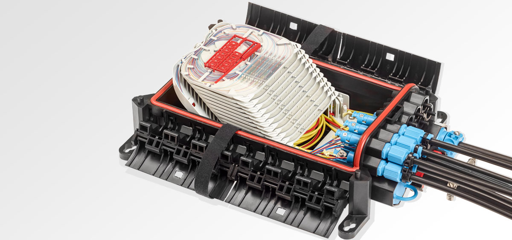

- **Empalme mecánico**

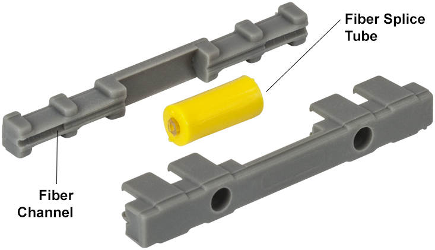

- **Empalme por fusión**

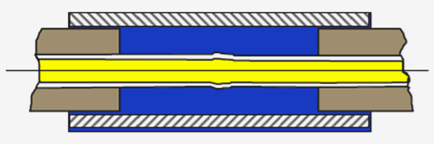

- **Pérdidas causadas por empalmes**
	- **Desalineación**

	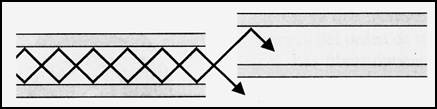
	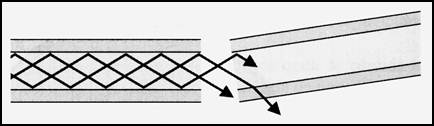

	- **Espacios vacíos**

	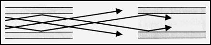

	- **Superficies rugosas**

	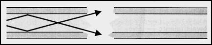

	- **Diámetros distintos**

	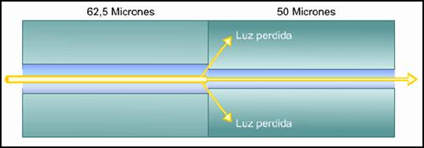

- **Conectores**

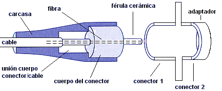
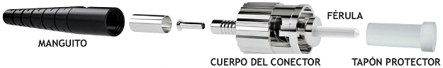

- **Pulido de la fibra** -> Se hace tras el corte para evitar pérdidas en la transmisión

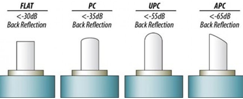

- **Impurezas en empalmes de fibra**

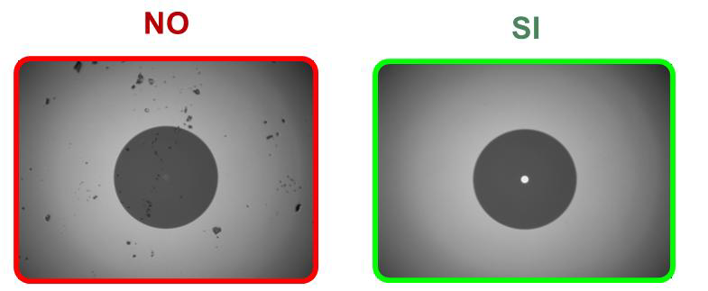

### Recursos
- [MontajeConectorLC](https://www.youtube.com/watch?v=_loIfxQ-nYc)
- [EmpalmeFusion](https://www.youtube.com/watch?v=qiKXaEcyHQE)
- [EmpalmeMecánico](https://www.youtube.com/watch?v=yovNGSz3uKc)
- [ConectoresYCables](https://www.youtube.com/watch?v=YLH81B_f_o8)