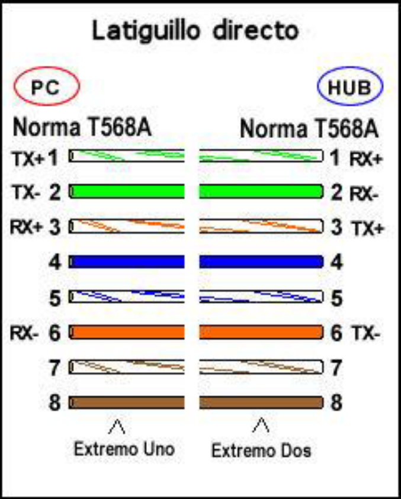

# Tema 4 Redes Locales

---

## Índice
1. **Cables UTP**
2. **Métodos de transmisión**
3. **Fibra óptica**
4. **Estándares Ethernet**
5. **Cableado estructurado**
6. **Ejercicios prácticos**

---

## Cables UTP
### ¿Qué es un tester o probador?

Es un dispositivo de prueba de **cables de par trenzado de cobre**. 

Emite una señal eléctrica por **cada uno** de los pines o hilos del conector RJ45 y **comprueba** su llegada en la otra parte del probador. 

Es de gran utilidad para saber si los hilos de nuestro cable hacen un **correcto contacto** con el conector RJ45. 

### Latiguillos y crimpado
Existen dos estándares principales para la disposición de los hilos de cobre en el conector RJ45, estos son:

Estos latiguillos pueden ser **directos** o **cruzados**. 

En el caso de una conexión entre un equipo y un switch/router/hub no es necesario un cable cruzado, usaremos un cable **directo**, porque este es capaz de organizar internamente el orden de los pines. 

En el caso de una conexión entre dos equipos deberemos usar un cable de par trenzado de cobre **cruzado**. 

Si decidieramos usar en cable **directo** para interconectar dos equipos nos encontraríamos con que el hilo usado para transferencia coincidirá con el hilo de transferencia de el otro extremo, lo cual causará una colisión: 
Se debe alterar el orden para que un extremo de transferencia coincida con el de recepción del otro extremo. 

### Recursos
- [Crimpar RJ45](https://www.youtube.com/watch?v=YCEGfxOX5Ws)
- [Montaje de una LAN](https://www.youtube.com/watch?v=Wa2GF5DIv9I)

---

## Medios de transmisión
### Bandas de transmisión

- **Banda base** -> Solo se transmite una única comunicación, la señal es enviada tal cual por el medio de transmisión.
- **Banda ancha** -> Se transmiten varias comunicaciones simultáneas, la señal se modula para poder transportar varias por el mismo medio de transmisión.

### Parámetros de transmisión

- **Velocidad de transmisión** -> Cantidad de información transmitida por unidad de tiempo, medida en bits por segundo.
- **Ancho de banda** -> Máxima velocidad de transmisión que ofrece un medio de transmisión en condiciones ideales.
- **Latencia** -> Tiempo que tarda un primer bit transmitido desde que se emite hasta que llega a destino.
- **Atenuación** -> Pérdida de potencia de una señal producida al transitar por el medio. Aumenta conforme a la distancia recorrida. Se mide en **decibelios (dB)** o en porcentajes.
- **Ruido (interferencia electromagnética)** -> Perturbación de la señal original causada por la inducción electromagnética.
- **Dispersión** -> Se produce en medios de transmisión ópticos (luz) debido a la variación del ángulo de incidencia del haz de luz.
- **Diafonía o *crosstalk*** -> Interferencia producida entre señales cuando los cables están muy juntos.

### Transmisiones: Analógicas vs Digitales

- **Señal analógica** -> Valores continuos, por ejemplo: 1V, 1.5V, 2V, 3V, 3.2V, 5V...
- **Señal digital** -> Valores discretos, por ejemplo: 0V o 5V (0 o 1), no hay un punto medio.

### Recursos
- [Presentacion](./medios-de-transmision.odp)
- [PDF](./medios-de-transmision.pdf)
- [Diferencias-CAT5-CAT6](https://www.youtube.com/watch?v=xrUvHGealZg)

---